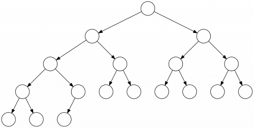

# 트리(Tree)

* 자료들 사이의 계층적 관계를 나타내는데 사용하는 자료구조
* 1개 이상의 노드를 갖는 집합으로 다음의 조건 만족한다.
  * 루트(root) 노드가 존재
  * 트리의 부분트리(Sub Tree) 또한 트리 구조를 따름
* 사이클(cycle)이 존재하지 않음


## 트리(Tree)의 활용

* 폴더 구조
* DBMS
* 검색 엔진

... 

* Union&Find -> 사이클 판별 문제
* 최소 신장 트리(Minimum Spanning Tree)
* 최소공통조상(Lowest Common Ancestor)


## 트리(Tree)의 용어

* **루트 노드(Root Node)**
  트리의 최상위 노드. 유일하다.

* **깊이(Depth)**
  루트 노드에서 해당 노드까지 도달하는데 사용하는 **<u>간선</u>**의 개수
  루트 노드는 자기 자신까지 도달하는 개수가 0이므로 루트 노드의 깊이는 0이다.

* **레벨(Level)**

  노드의 깊이 + 1

* **부모 노드(Parent Node)**
  부모 자식 관계에서 상위 계층에 있는 노드
  상위 계층에 있을 수록 노드의 깊이와 레벨이 낮다.

* **자식 노드(Child Node)**
  부모 자식 관계에서 하위 계층에 있는 노드

* **형제 노드(Sibling Node)**
  부모가 동일한 노드

* **조상 노드**
  해당 노드의 부모 노드부터 루트 노드까지 가는 경로에 존재하는 노드들

* **후손 노드**
  해당 노드를 루트로 하는 서브트리에 있는 모든 노드

* **노드의 분지 수(노드의 차수, Degree)**
  노드의 자식 수

* **트리의 분지 수(트리의 차수)**
  해당 트리 내 모든 노드의 분지 수 중 최댓값

* **내부 노드(Internal/nonterminal Node)**
  자식이 있는 노드

* **외부 노드(leaf/external/terminal Node)**
  자식이 없는 노드

* **높이**
  루트 노드에서 해당 노드까지 도달하는데 지나간 **<u>정점</u>**의 개수
  노드 중 가장 높이가 높은 노드의 높이를 **<u>트리의 높이</u>**라고 함


## 이진 트리(Binary Tree)

트리의 분지 수가 2 이하인 트리. 대부분의 트리 자료구조는 이진 트리 형태에서 나온다.


### 이진 트리의 특징

* 자식이 최대 2개이기 때문에 자식을 왼쪽 자식과 오른쪽 자식으로 구분함

* 높이가 N인 이진 트리의 최대 노드 개수
  $$
  {2}^N-1
  $$
  

### 이진 트리의 종류

#### 정 이진 트리(Full Binary Tree)


▲ 출처 : https://www.gatevidyalay.com/binary-tree-types-of-trees-in-data-structure/

* 모든 노드의 차수가 0 또는 2인 이진 트리

#### 포화 이진 트리(Perfect Binary Tree)


▲ 출처 : https://jackpot53.tistory.com/7

* 정 이진 트리에서 모든 단말 노드(leaf)의 깊이가 같은 이진 트리

* 높이가 H인 포화 이진 트리의 노드 개수
  $$
  {2}^H-1
  $$
  

* 반대로 노드가 N개인 포화 이진 트리의 높이
  $$
  log_2(N+1)
  $$
  

* 깊이가 D인 포화 이진 트리의 단말 노드(leaf) 개수
  $$
  {2}^D
  $$
  


#### 완전 이진 트리(Complete Binary Tree)



▲ 출처 : http://coj.uci.cu/24h/problem.xhtml?pid=2958

* 마지막 레벨은 노드가 왼쪽에 몰려있고, 마지막 레벨을 제외하면 `포화 이진 트리` 구조를 띄고 있는 이진 트리

#### 사향(편향) 이진 트리(Skewed Binary Tree)


▲ 출처 : https://stackoverflow.com/questions/25627454/creating-a-right-skewed-binary-tree-in-c

* 연결리스트처럼 한 줄로 연결 되어 있는 형태의 이진 트리
* 검색에 성능 이슈가 있어, 문제점을 극복하기 위해 AVL트리, 레드-블랙트리로 변화되어 활용


### 이진 트리의 표현

* **연결 자료 구조 - 연결리스트 형태의 자료구조**

```java
class Node{
  Object data;
  Node left_child, right_child; 
}
```


* **연속 구조 - 일차원 배열을 이용한 구현**

배열에 트리 노드를 레벨 순서대로 왼쪽에서 오른쪽으로 저장. 

완전 이진 트리로 가정하고 배열의 1번 위치부터 저장을 시작한다고 가정했을 때 i번 노드의 부모, 왼쪽 자식, 오른쪽 자식을 구하는 방법은 다음과 같다.

```java
private static int parent(int index){
  return index/2;
}

private static int left_child(int index){
	return i*2; 
}

private static int right_child(int index){
  return i*2+1;
}
```


### 이진 트리의 순회(Binary Tree Traversal)

> 트리 구조의 데이터군에서 특정 데이터들을 삭제하고 싶어. 하지만 서브트리들을 어떻게 판별하고 삭제하지...?


* 트리는 비선형 자료구조이므로 모든 노드를 for문 한 번으로 방문이 불가능하다. 이런 트리 구조에서 모든 노드를 방문하기 위한 과정을 `트리의 순회`라고 한다.
* 특히 이진 트리의 순회는 왼쪽 자식 탐색, 오른쪽 자식 탐색, 현재 노드의 방문의 세가지 주요 과정을 통해 진행되며, 노드를 방문하는 순서에 따라 **<u>전위 순회, 중위 순회, 후위 순회</u>**로 나뉜다.
* 모든 순회는 **루트 노드**에서 시작한다.


> * **전위 순회(pre-order)** -> 트리의 복사본 생성, 수식 트리에서 prefix 수식 얻기
>
> 1. 현재 노드 방문
> 2. 왼쪽 자식 탐색
> 3. 오른쪽 자식 탐색
>
> 방문 순서 : A - B - D - E - H - C - F - G
>
> * **중위 순회(in-order)** -> 이진 탐색 트리에서 오름차순으로 노드 얻기
>
> 1. 왼쪽 자식  탐색
> 2. 현재 노드 방문
> 3. 오른쪽 자식 탐색
>
> 방문 순서 : D - B - H - E - A - F - C - G
>
> * **후위 순회(post-order)** -> 트리 삭제, 수식트리에서 postfix 수식 얻기
>
> 1. 왼쪽 자식 탐색
> 2. 오른쪽 자식 탐색
> 3. 현재 노드 방문
>
> 방문 순서 : D - H - E - B - F - G - C - A

3가지 순회 방법은 재귀를 통해 손쉽게 구현할 수 있음.


*** 순회 관련 문제

* [트리 순회](https://www.acmicpc.net/problem/1991)
* [트리의 순회](https://www.acmicpc.net/problem/2263)
* [이진 검색 트리](https://www.acmicpc.net/problem/5639)


### 이진 트리의 응용

* 힙(Heap) -> 정렬, 우선순위큐...
* 인덱스 트리(Indexed Tree) -> 누적합...
* 트라이(Trie) -> 문자열 검색...

## 


## Quiz

* 최소 스패닝 트리에 대해 설명해주세요.


## 참고 자료

* 삼성SDS 대학생 동계 알고리즘 특강 교재
* https://jackpot53.tistory.com/7
* https://prosaist0131.tistory.com/entry/%ED%8A%B8%EB%A6%AC%EC%97%90-%EB%8C%80%ED%95%98%EC%97%AC


## Quiz 모범 답안


