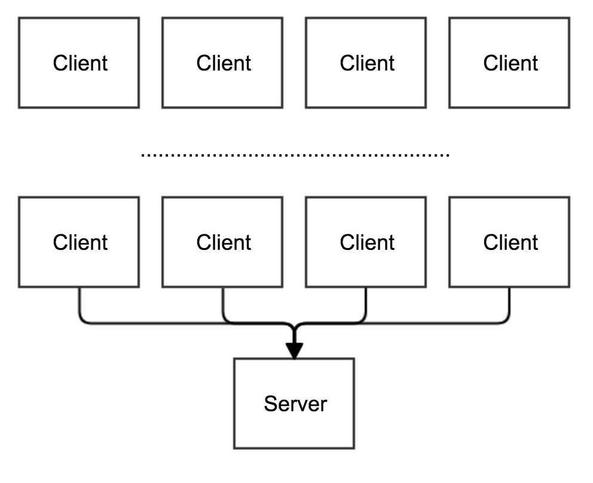
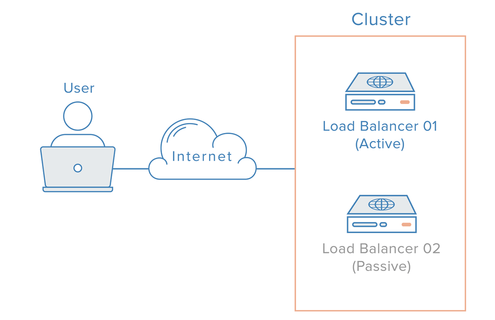

# 로드 밸런싱(Load Balancing, 부하 분산)

> 컴퓨터 네트워크 기술의 일종으로 둘 혹은 셋 이상의 중앙처리 장치 혹은 저장장치와 같은 컴퓨터 자원들에게 작업을 나누는 것을 의미한다. 이로써 가용성 및 응답 시간을 최적화시킬 수 있다.
>
> 출처: 위키백과

네트워크에서의 부하 분산은 VLAN을 이용한 Layer 2 부하 분산, Routing Protocol을 이용한 Layer 3 부하 분산, **<u>서버 부하 분산</u>** 등이 존재한다. 

## 서버 부하 분산

* 외부의 사용자로부터 들어오는 다수의 요청을 서버들에게 적절히 배분해 처리케 하는 것
* `부하 분산 Network Switch` 혹은 `소프트웨어`가 담당함
* 외부로부터의 요청을 서버가 직접 받지 않고, 담당 Network Switch 혹은 소프트웨어가 받아 적절히 나눠줌
* Network Switch를 L4/L7 Switch, Load Balancer라 부름
* 일반적으로 로드밸런싱, LB라고 하면 서버 부하 분산을 의미함.

L4 Switch만 하나의 공인 IP(123.111.43.1)를 갖고 각 서버 호스트는 사설IP를 갖는 PAT(NAT 종류) 형태의 구조에서 외부 클라이언트는 로드밸런서의 공인 IP로 접근한다. L4 Switch는 NAT를 기반으로 로드밸런싱을 수행한다.

## 왜 Load Balancer가 필요한가?

Client가 한 두명인 경우에는 Server가 여유롭게 클라이언트의 요청을 처리할 수 있다.

그러나, Client가 수천만명이라면? Server는 과부하에 동작을 멈추게 된다.

이를 해결하기 위해서는 두가지 방법이 있다.

* Scale-up : Server가 더 빠르게 동작하기 위해 하드웨어 성능을 올리는 방법
* Scale-out : Server의 개수를 늘려 여러 대의 Server가 나눠 작업을 수행하는 방법

Scale-out이 일반적으로 비용이 더 적고, 무중단 서비스를 운용하기 용이하기 때문에 주로 채택된다. 이때, 여러 대의 Server에게 균등하게 Traffic을 분산시켜 주기 위해 **<u>Load Blancer</u>**를 사용한다. 서비스를 운영하는 사이트의 규모에 따라 웹 서버를 추가로 증설하면서 로드 밸런서로 관리해주면 웹 서버의 부하를 해결할 수 있다.

## 서버 부하 분산의 방법

### Round Robin

* 로드밸런서가 다수의 서버에게 순서대로 요청을 할당하는 방법
* 가장 단순함

### Least Connection

* 로드밸런서가 서버에게 요청을 전달하고, 사용자와 서버가 정상적인 연결을 맺으면 사용자와 서버는 Connection을 생성함(3 - handshake)
* 로드밸런서 또한 중간자로서 Connection 정보를 갖고 있는데 이 Connection 수 정보를 기반으로 가장 Connection이 적은 서버, 즉 부하가 가장 덜한 서버로 요청을 전달함.
* 트래픽으로 인해 세션이 길어지는 경우 권장

### Ratio(가중치)

* 서버의 처리 능력을 고려해 할당될 수 있는 각 서버가 가질 수 있는 Connection의 비율을 정해두고, 이를 토대로 부하를 할당하는 방법

### Fastest

* 응답속도가 가장 빠른 서버에게 우선적으로 할당하는 방법

e.g. 서버에 할당된 Connection이 5개인데 Response도 5개라면 갖고 있는 Connection에 대해 모두 응답하고 있으므로 성능이 충분하다고 판단해 추가 요청을 보냄. 만약 Response의 수가 더 적다면 추가 요청을 해당 서버로 보내지 않음.

### Source

* 사용자 IP를 해싱하여 분배하는 방식
* 특정 사용자가 항상 서버로 연결되는 것 보장

## Load Balancer 장애 대비

서버를 분배하는 로드 밸런서에 문제가 생길 수 있기 때문에 로드 밸런서를 이중화해 대비한다.

* 이중화된 Load Blancer들은 서로 Health Check를 함
* Main Load Balancer가 동작하지 않으면 VIP(Virtual IP)는 여분의 Load Balancer로 변경된다.
* 이후 여분의 Load Balancer로 운영된다.

# 출처

* [서버 부하 분산 쉽게 이해하기 - 네트워크 엔지니어 환영](https://aws-hyoh.tistory.com/entry/Server-Load-Balancing-%EC%89%BD%EA%B2%8C-%EC%9D%B4%ED%95%B4%ED%95%98%EA%B8%B0?category=767420)
* [서버 구축이야기! 블로그](https://server-talk.tistory.com/)
* [로드밸런서란? - Nesoy Blog](https://nesoy.github.io/articles/2018-06/Load-Balancer)
* [신입 개발자 전공 지식 & 기술 면접 백과사전](https://github.com/gyoogle/tech-interview-for-developer)

